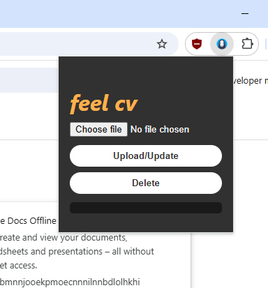

# AI-Powered Job Application Assistant

An intelligent browser extension that automates the process of parsing your resume and auto-filling job application forms using AI.

---

## Features

- **Resume Parsing**  
  Upload `.pdf`, `.docx`, or `.txt` resumes. Structured data is extracted using OpenAI/Gemini.

- **Smart Auto-Fill**  
  Detects and fills form fields on job portals using HTML structure and AI-enhanced mapping.

- **Cross-Browser Support**  
  Works on Chrome, Firefox, and Safari.

- **Dark Mode UI**  
  Clean, responsive popup interface with real-time feedback and status indicators.

---
## Preview 


## Installation

1. Clone this repository:
   ```bash
   git clone https://github.com/yourusername/job-assistant-extension.git
2. Add your own OpenAI API key to the script. Your key should be add in popup.js assigning it to the variable named "OPENAI_API_KEY".

3. Load the extension:

    - Open chrome://extensions/
    - Enable Developer mode
    - Click Load unpacked and select the project folder

## Technologies Used

    - JavaScript (ES6+)
    - OpenAI GPT / Gemini API
    - PDF.js, Mammoth.js
    - Chrome Extension APIs
    - Tailwind CSS (for UI)

## File supported 

.pdf | .docx | .txt


## Folder Structer 
```
├── popup.html        # UI for the popup
├── popup.js          # Main extension logic
├── styles.css        # TailwindCSS for styling
├── background.js     # For form-filling in content scripts
├── manifest.json     # Chrome extension config
├── utils/            # Utility functions for parsing, validation
├── screenshots/      # Demo images
└── README.md

```
